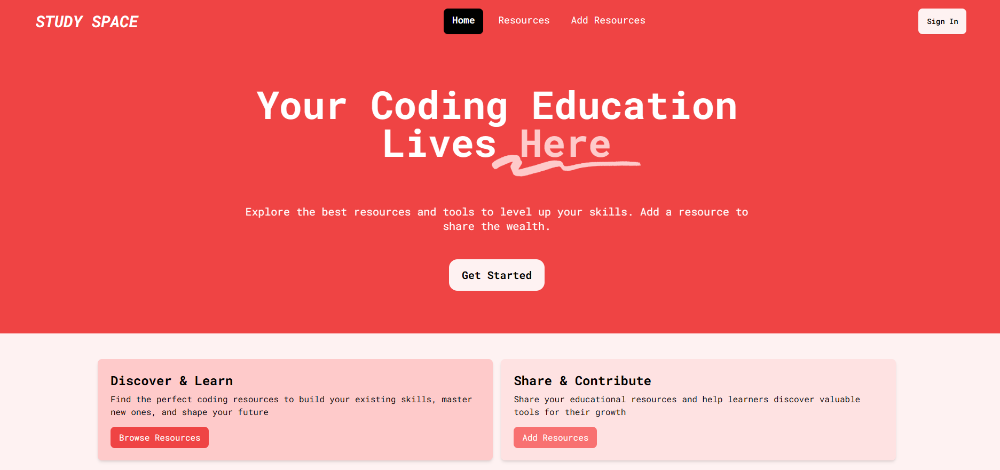

# **Study Space**

A full-stack MERN application that helps developers share and discover educational resources. Users can authenticate with Google, create, manage, and explore various types of educational content including books, courses, videos, and more.

Made for educators to share valuable coding tools, guides, and materials, and for learners to browse and discover the best resources to enhance their coding skills.





## **Features**

* **Discover & Learn:** Browse curated coding resources, including courses, guides, tutorials, and more to start or advance your coding journey.
* **Share & Contribute:** Share your educational tools, courses, tutorials, and materials with the learning community.
* **Resource Management**: Add, edit, and remove resources to keep the library up to date.
* **Filter:** Easily search for resources based on type, skill level, and category.
* **Users:** A profile with the ability to browse all of your own resources.
* **Google OAuth Authentication** : Secure user authentication using Google login
* **Resource Categories** : Multiple resource types including:
* * Books
  * Online Courses
  * Video Tutorials
  * Websites
  * GitHub Repositories
  * YouTube Channels
  * Bootcamps
  * Communities
* **Difficulty Levels** : Resources categorised by:

  * Beginner
  * Intermediate
  * Advanced
  * Everyone
* **Protected Routes** : Secure access control for authenticated users
* **Responsive Design** : Mobile-friendly interface using Tailwind CSS

## **Tech Stack**

### Frontend

* React + Vite
* React Router v6
* Tailwind CSS
* Context API for state management

### Backend

* Node.js
* Express.js
* MongoDB
* Mongoose
* Passport.js with Google OAuth 2.0

## 📋 Prerequisites

Before you begin, ensure you have the following installed:

* Node.js (v14 or higher)
* MongoDB
* npm or yarn

You'll also need:

* A Google Cloud Console account for OAuth credentials
* MongoDB Atlas account (for production database)

## **Getting Started**

### 1. Clone the repository

`https://github.com/zaryabnaqvi/studyspace-FE`

### 2. Install dependencies

Navigate to the project directory and install the necessary dependencies:

```js
//Frontend
cd edu/
npm install

//Backend
cd backend/
npm install
```

### 3. Create your environment variables

Create a .env file in the config folder in the backend directory:

```js
PORT=5000
MONGODB_URI=your_mongodb_connection_string
GOOGLE_CLIENT_ID=your_google_client_id
GOOGLE_CLIENT_SECRET=your_google_client_secret
```

Create a `.env` file in the frontend directory:

```js
VITE_API_URL=http://localhost:5000/api
VITE_BASE_URL=http://localhost:5000
```

### 4. Start the server

For development purposes, run the API with the following (make sure you're in backend/):

`node server.js --watch`

The API should now be available at `http://localhost:5000/api/resources`.

### 5. Run the application

In another terminal window, start the application locally (make sure you're in edu/):

`npm run dev`

The app should now be running at `http://localhost:4444`.

## **How It Works**

### **For Educators:**

Educators can add their educational materials, guides, and courses by clicking "Add Resources". Each resource can include details like title, description, type (course, tutorial, etc.), and more.

### **For Learners:**

Learners can browse through a list of curated resources to find the perfect content based on their skill level and interests.

### **CRUD Operations:**

* **Add a Resource:** Create new educational tools or content for others to access.
* **Edit a Resource:** Modify existing resources to ensure they are up-to-date.
* **Delete a Resource:** Remove outdated or irrelevant resources.

### **Routing with React Router:**

This app uses **React Router** to handle navigation between different pages, such as the home page, the "Add Resource" page, and individual resource detail pages.

### **State Management with React `useState`:**

State is managed using React's `useState` hook to dynamically render data (e.g., resources) and handle updates across the app.

### **Styling with Tailwind CSS:**

The app uses **Tailwind CSS** for styling, providing a fast and efficient way to design responsive, customisable user interfaces.

## Future Improvements

* [X] User profiles with saved resources
* [ ] Advanced search and filtering
* [ ] Resource sharing functionality
* [ ] Resource recommendations
* [ ] List creation (like GitHub with stars, create a list and add resources to a list)
* [ ] Private or public resources
* [ ] Minor UI changes

## Contributing

I welcome contributions to improve this platform! If you'd like to help, please follow these steps:

1. Fork the repository
2. Create a new branch (`git checkout -b feature/your-feature-name`)
3. Make your changes
4. Commit your changes (`git commit -m 'Add new feature'`)
5. Push to the branch (`git push origin feature/your-feature-name`)
6. Create a pull request
