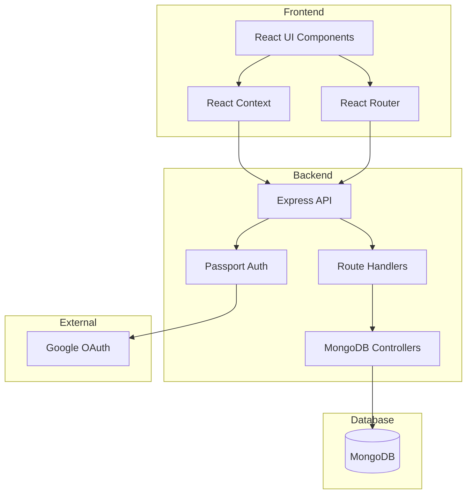

# Project Flow

🔒 Authentication Flow

User clicks "Sign In" button
Redirected to Google OAuth consent screen
After successful authentication:

User profile is created/updated in database
Session is created
Redirected back to application

Protected routes become accessible

🚦 API Endpoints
Authentication Routes

GET /auth/google: Initiate Google OAuth flow
GET /auth/google/callback: Google OAuth callback
GET /auth/logout: User logout
GET /auth/current-user: Get current user info

Resource Routes

GET /api/resources: Get all resources
POST /api/resources: Create new resource
GET /api/resources/:id: Get specific resource
PUT /api/resources/:id: Update resource
DELETE /api/resources/:id: Delete resource

Database Schema
Resource Model
javascriptCopy{
  title: String,
  type: Enum['Book', 'Repository', 'Video', 'Website', 'Bootcamp', 'Youtube Channel', 'Course', 'Community'],
  level: Enum['Beginner', 'Intermediate', 'Advanced', 'Everyone'],
  description: String,
  createdBy: String,
  info: {
    category: String,
    link: String,
    published: String
  },
  user: ObjectId (ref: 'User')
}
User Model
javascriptCopy{
  googleId: String,
  email: String,
  displayName: String,
  firstName: String,
  lastName: String,
  avatar: String,
  createdAt: Date
}

